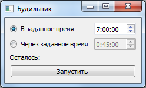
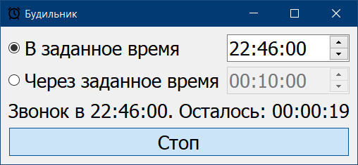
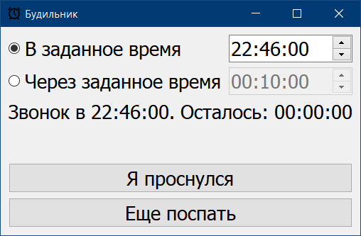

# alarm-clock
Будильник (#python #python3 #alarmclock #PyQt5 #Qt)

##### Скриншоты:

##### 

---

Icons made by <a href="https://www.flaticon.com/authors/andy-horvath" title="Andy Horvath">Andy Horvath</a> from <a href="https://www.flaticon.com/" title="Flaticon">www.flaticon.com</a>

Music by <a href="https://pixabay.com/users/mondmatt-25609953/?utm_source=link-attribution&utm_medium=referral&utm_campaign=music&utm_content=130417">Harald</a> from <a href="https://pixabay.com/music//?utm_source=link-attribution&utm_medium=referral&utm_campaign=music&utm_content=130417">Pixabay</a>
